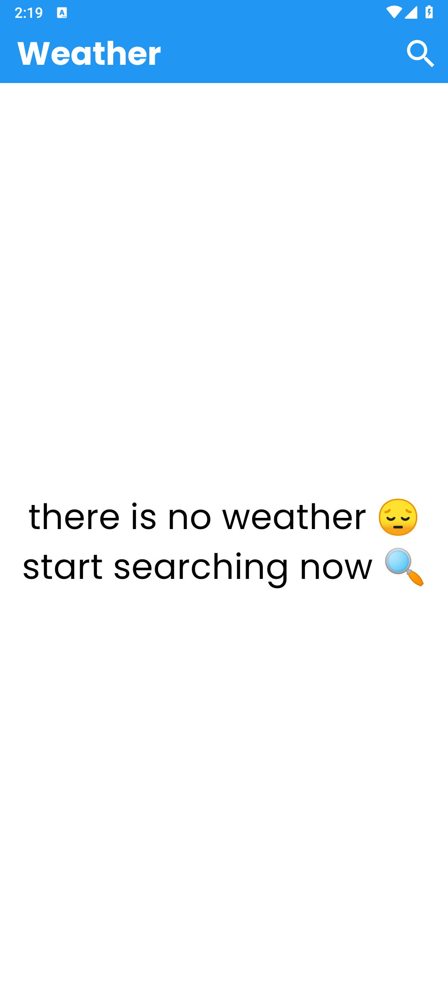
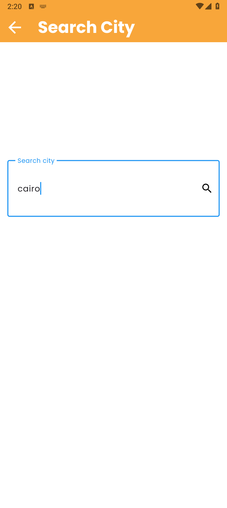
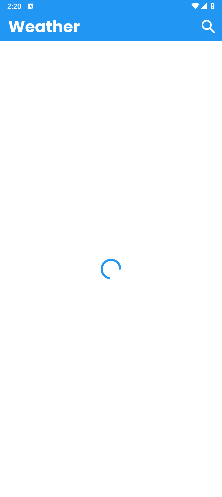
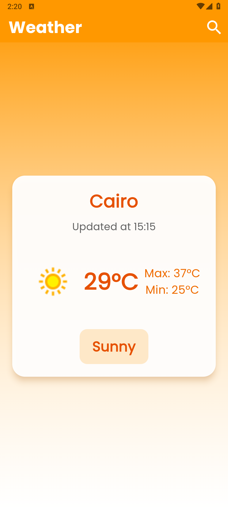
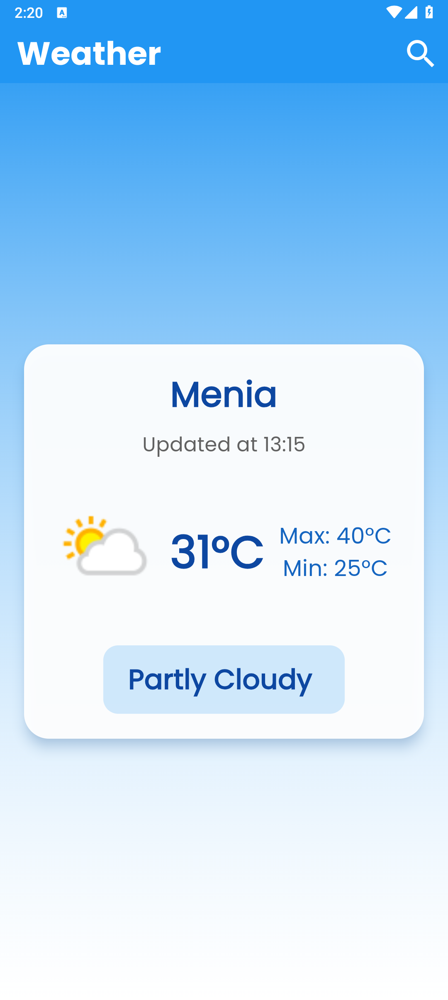
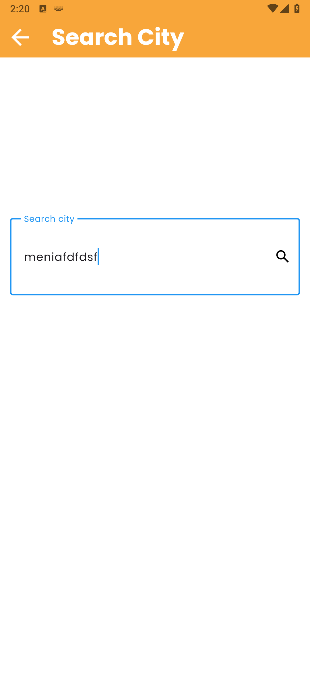
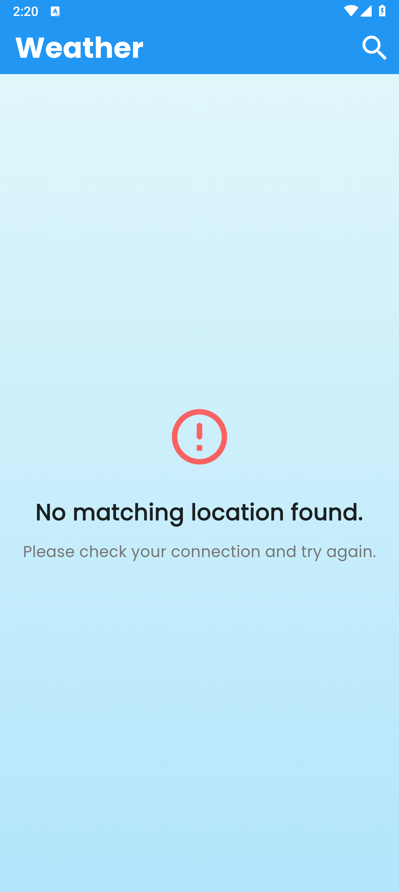

# Weather App

A clean, modern weather application built with Flutter. This app allows users to search for any city worldwide and get the latest weather updates. It features a dynamic theme that changes color based on the current weather condition, providing a visually immersive experience.

## Features

- **City Search:** Find real-time weather data for any city.
- **Dynamic Theming:** The app's color scheme adapts to the current weather condition (e.g., orange for sunny, blue for rain).
- **Detailed Weather Info:** Displays current temperature, max/min temperatures, and a descriptive weather condition.
- **State Management:** Utilizes the BLoC pattern for predictable and scalable state management.
- **Responsive UI:** Adapts to different screen sizes using `flutter_screenutil`.
- **Cross-Platform:** Built with Flutter for Android, iOS, Web, and Desktop support.

## Screenshots
<p align="center">
  
  
  
  
  
  
  
</p>

## Tech Stack & Architecture

- **Framework:** [Flutter](https://flutter.dev/)
- **State Management:** [Flutter BLoC](https://pub.dev/packages/flutter_bloc)
- **Networking:** [Dio](https://pub.dev/packages/dio) for handling HTTP requests.
- **API:** [WeatherAPI.com](https://www.weatherapi.com/)
- **UI:** [Google Fonts](https://pub.dev/packages/google_fonts), [Flutter ScreenUtil](https://pub.dev/packages/flutter_screenutil), [Top Snackbar Flutter](https://pub.dev/packages/top_snackbar_flutter)
- **Architecture:** The project follows a clean architecture with a clear separation of concerns:
    - **UI (Views/Widgets):** Responsible for rendering the user interface.
    - **State (Cubit):** Manages the application's state and business logic.
    - **Service:** Handles data fetching from the remote API.
    - **Model:** Defines the data structure for weather information.

## Getting Started

To get a local copy up and running, follow these simple steps.

### Prerequisites

- Flutter SDK installed. For guidance, see the official [Flutter documentation](https://flutter.dev/docs/get-started/install).

### Installation & Setup

1.  **Clone the repository:**
    ```sh
    git clone https://github.com/OmarGamalDev/weather.git
    cd weather
    ```

2.  **Get an API Key:**
    - Sign up on [WeatherAPI.com](https://www.weatherapi.com/) to get a free API key.
    - Open the `lib/services/weather_service.dart` file.
    - Replace the placeholder `apiKey` with your own key:
      ```dart
      class WeatherService {
        // ...
        final String apiKey = "YOUR_API_KEY_HERE";
        // ...
      }
      ```

3.  **Install dependencies:**
    ```sh
    flutter pub get
    ```

4.  **Run the application:**
    ```sh
    flutter run
    ```

## Project Structure

The project is organized into the following directories under `lib/`:

```
lib/
├── cubit/            # Contains BLoC cubits for state management (weather_cubit, weather_state)
├── models/           # Data models (weather_model.dart)
├── services/         # API service for fetching weather data (weather_service.dart)
├── views/            # Application screens or pages (home_view.dart, search_view.dart)
└── widgets/          # Reusable UI components used across the app